

## About Project

HotelBnb or Booking Core is a booking bnb system based on Laravel / Vue / Vuex / SPA /REST / API , designed for a travel website, Marketplace, Travel Agency, Tour Operator, andRoom Bnb. The application offers an opportunity to search for reservation across large numberof hotels. You can also leave a review for your booking. The application also have a basketactivated with payment methods in order to purchase one or more booking across various hotels.

- [HotelBnb First Prototype](https://youtu.be/jOyXlTxzhpk).
- [Live Demo for HotelBnb Full Project](https://youtu.be/9SDOErTJr0c).

## Description
HotelBnb  is a booking bnb system based on Laravel / Vue / Vuex / SPA /REST / API , designed as a Travel website, Marketplace, Travel Agency, Tour Operator, and Room Bnb. The application offers an opportunity to search for reservation across large number of hotels, make booking for a room at the selected period of time. You can also leave a review for your booking through a 36 char length key generated once you confirm your booking and  make payments. The application also have a basket page activated with payment methods (PayPal) in order to purchase one or more booking across various hotels.
The system has two modes 1-Anonymous Mode without authentication in this mode the review key sent through an SMS message or your payments confirmation e-mail. 2-Authentication Mode which gives user ability to register and login through the system, the info about your bookings with the ability to review them exists at profile page. 
The system has an admin dashboard, which gives ability to admin to view/edit/delete [Users, Bookables, Boookings, Reports]. The dashboard also provide charts of Bookings rate through the system,  also an admin has the ability to export all of the above information as [Excel,PDF,CSV,Print].....

## Overview

### Register/Sign-in

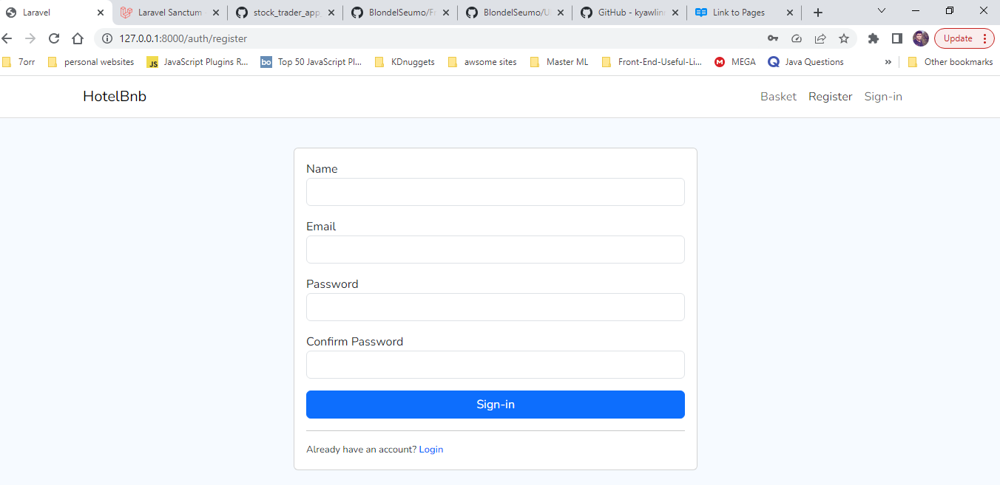
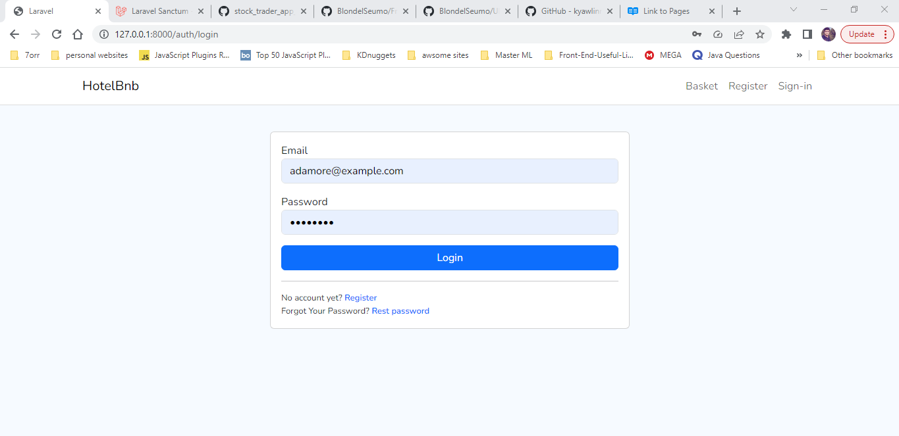

### Home

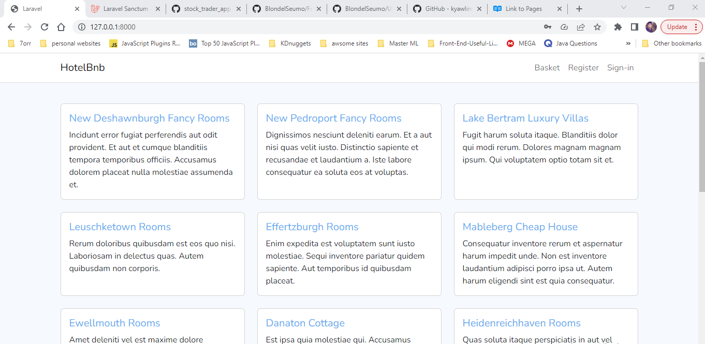

### Bookable

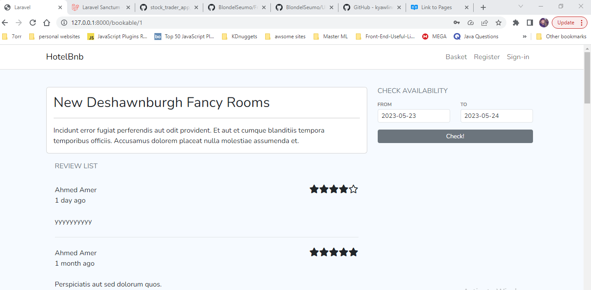

### Check Availability

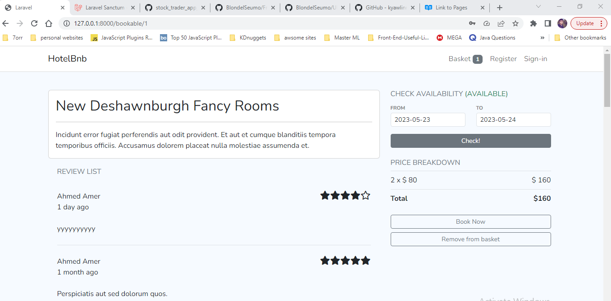

### Basket

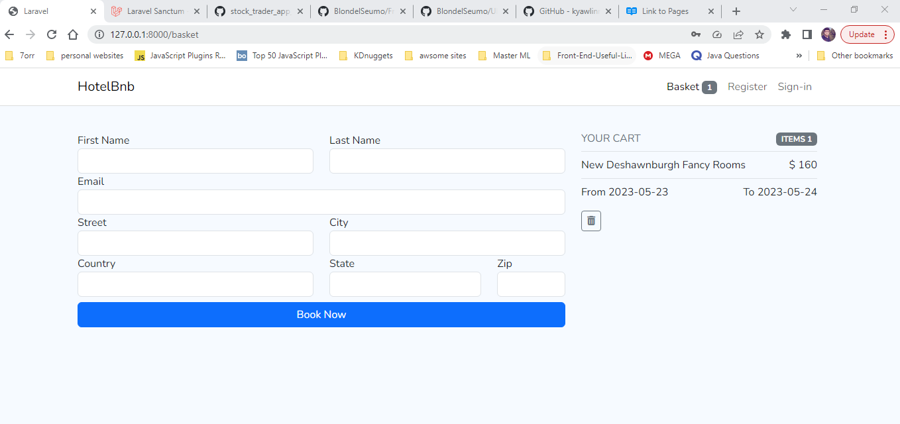

### Profile

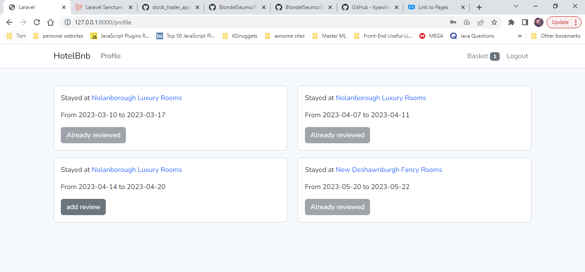

### Review Booking

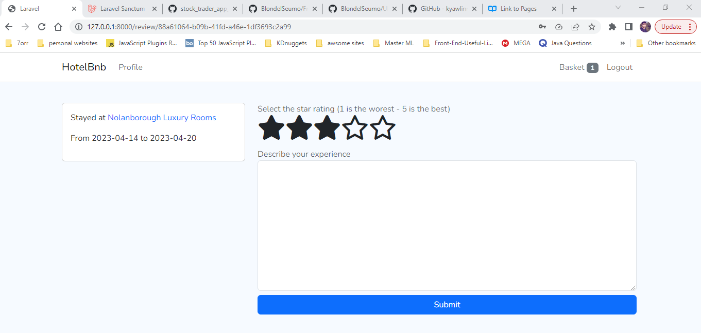

### Admin Dashboard

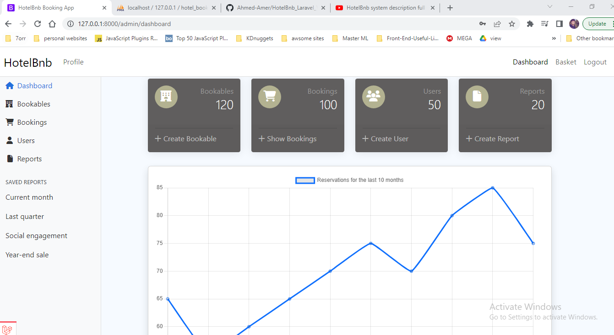
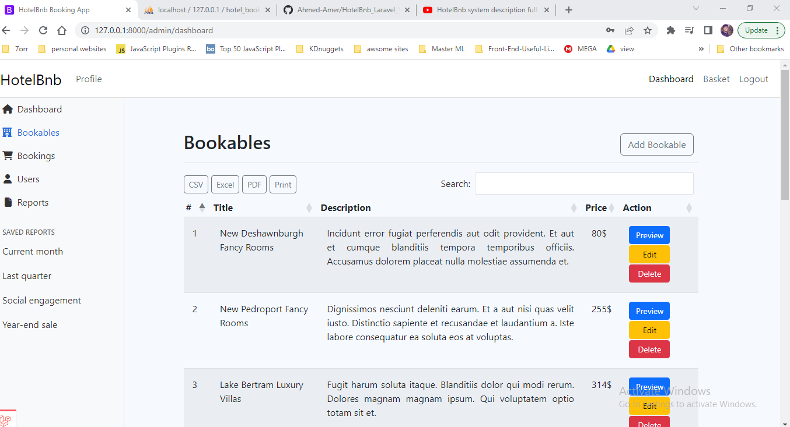
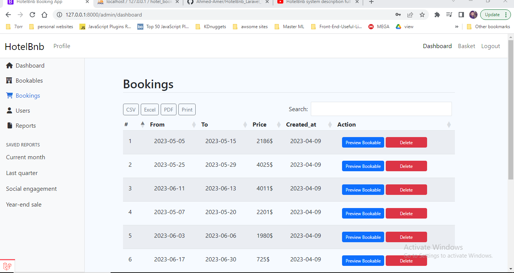
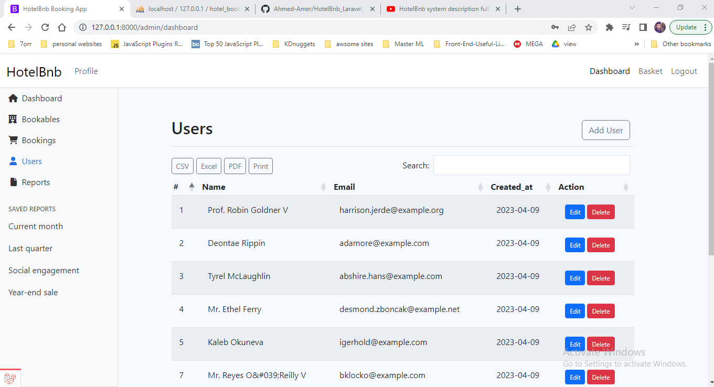
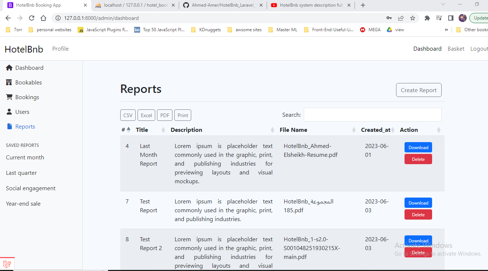
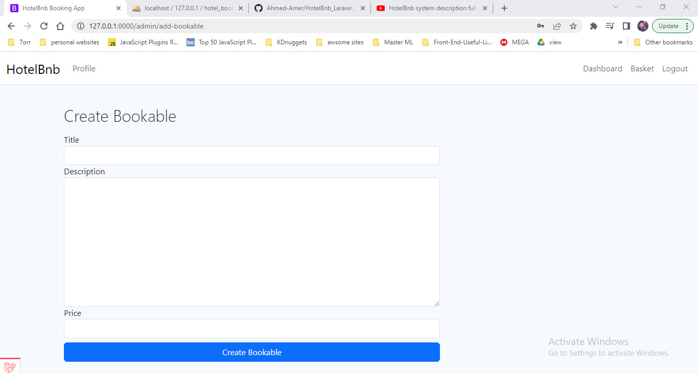
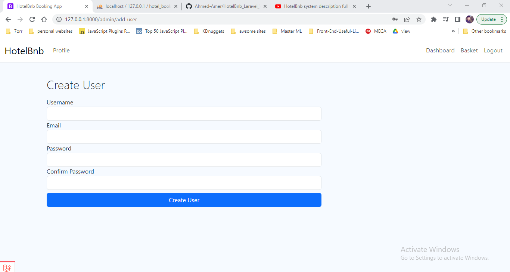
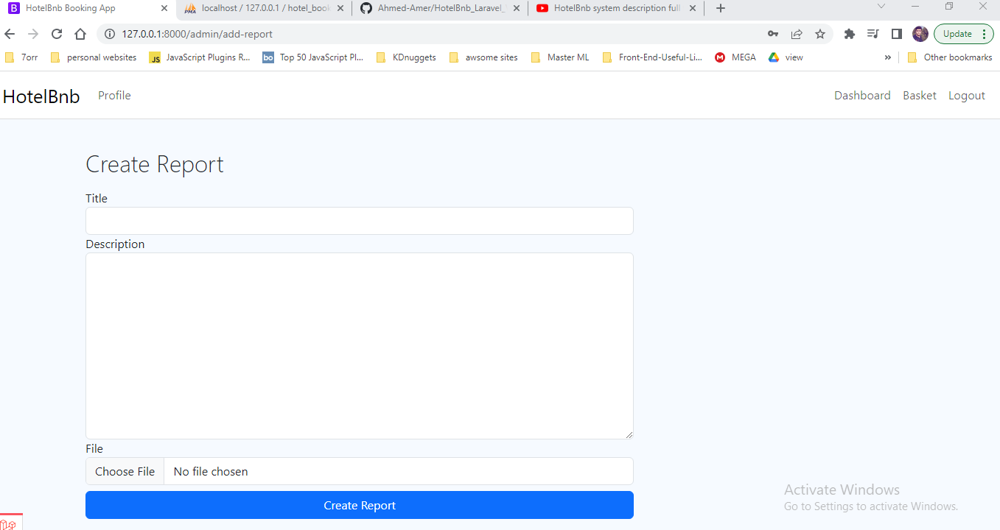

